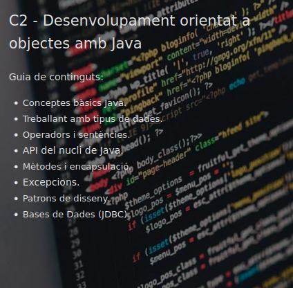

# Java Inheritance Task's Repository

## Index

1. [Index](#Index)
2. [Preface](#Preface)
3. [Contents](#Contents)
4. [Prerequisites](#Prerequisites)
5. [Additional Information](#Additional-Information)

## Preface

This repository contains our group's progress towards the mastering of Java's Inheritance ins-n-outs.

It's divided on a series of folders containing the Eclipse projects that hold each one of them.

## Contents

1. Electrodomestic
2. TV Series
3. Book
4. Cinema

## Prerequisites

To compile and use each file & project inside this repository; it's recommended to follow the
original requisites for JDK/JRE versioning that were specified during the bootcamp.

Java Development Kit (JDK)

```bash
$ java -version
openjdk version "1.8.0_312"
OpenJDK Runtime Environment (build 1.8.0_312-8u312-b07-0ubuntu1-b07)
OpenJDK 64-Bit Server VM (build 25.312-b07, mixed mode)
```

Java Runtime Environment (JRE)

```bash
$ javac -version
javac 1.8.0_312
```

## Additional Information

<br>

